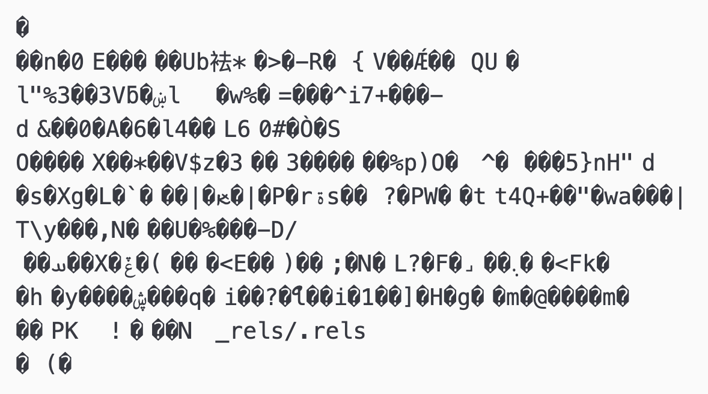
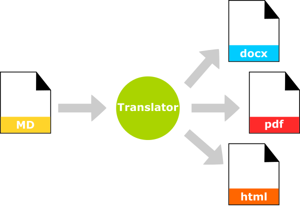

## The Ethos of Markdown

There are a couple of things that make markdown stand out as a tool for authoring documents. The first is that it is plain text. The second is that separates document structure from document styling. This way, we focus on what we want to write, and when that is done, we provide styling or aesthetics.

### Plain Text

Plain text files are files that contain only text characters--no formatting, no images etc. Plain text also usually means that our text characters are encoded as ASCII or UTF-8. Using 0s and 1s, various combinations of these 0s and 1s represent certain characters according to these two standards. For example, the following byte `01001101` is ASCII coding for the letter `M`. ASCII has been around since the 1960s. ASCII can represent 128 characters. UTF-8 can represent many, many more characters, but is backwards compatible with ASCII. UTF-8 is the encoding used on the web.

As ASCII is a kind of benchmark, this in effect means that any ASCII plain text file can be opened by any text editing program on any computer on any operating system. Even if that file was written 40 years ago. Or will need to be opened in another 20 years.

This is quite different from say a document written in Microsoft Word, which only renders perfectly in Word and only in versions of Word that support that particular document\'s formatting. This kind of rot, or inability to access content, has plagued authors for decades, especially when there was a lot more competition among word processors.

If we were to try and open a Word document in a text editor, we\'d see something like this



### Structure vs Styling

When an authoring environment separates out structure from styling, it allows us to focus on each independently of the other, encouraging the writer to focus first and foremost on what they want to say and then subsequently on how this will be formatted.

Editors like Microsoft Word of LibreOffice wed these together so that styling - fonts, colours, spacing around elements, page breaks etc - are part of the writing process.

Markdown encourages the writer to think only about document structure and prose while writing - that is, should this be a heading, subheading, list, table etc - and to look at how these elements are formatted once writing is complete - 1st level headers should 16pt Helvetica bold, tables should span the full width of the page, list items should be preceded by bullets not dashes etc.

## How Markdown Works

1. You write your content, providing the structure and the prose in plain text.
2. Another program adds style to your content and encodes it in a particular format, whether that be for the web, as a pdf, or a Word document.

Your working copy is your plain text markdown document. Your distribution copy is the the stylized, formatted version.



## A (Brief) History of Markdown

Markdown was conceived to support web authoring. `html`, like markdown, is plain text, but more cumbersome to write. If you right click in your web browser and select \"View Page Source\" or the equivalent, you'll see the html markup that was written. Your web browser takes that marked up content and gives it style, formatting it so that it\'s (hopefully) enjoyable to interact with.

Markdown is a very quick way to author documents. It\'s formatting options are limited by its original intent to author web based prose. Web based prose was originally designed to support the dissemination of academic research. So Markdown is a perfect tool for authoring in academia.

## Markdown Basics

We\'ll cover the following today

  * headings
  * lists
  * links
  * images
  * tables

But there\'s more that you can do with Markdown, and you see a full guide here: [https://www.markdownguide.org/basic-syntax/](https://www.markdownguide.org/basic-syntax/)

Let\'s explore writing in Markdown...

Back to the console

```bash
open -a Atom 20210611_DHSI-Poster_Web-Materials.md # Mac

Atom 20210611_DHSI-Poster_Web-Materials.md # Windows
```

Review a sample of what we'll create here: [https://csc-ubc-okanagan.github.io/DS-Introduction/academic-cv.html](https://csc-ubc-okanagan.github.io/DS-Introduction/academic-cv.html)

See the raw markdown here: [https://csc-ubc-okanagan.github.io/DS-Introduction/academic-cv-md.html](https://csc-ubc-okanagan.github.io/DS-Introduction/academic-cv-md.html)

## Markdown cheatsheet

[New lines and paragraphs](#new-lines-and-paragraphs)  
[Headings](#headings)  
[Lists](#lists)  
[Links](#links)  
[Images](#images)  
[Tables](#tables)  

### New lines and paragraphs

**New lines** are demarcated with two spaces, `  `, at the end of the preceding line.

```
This is line 1  
This is line 2
```

This is line 1  
This is line 2

**Paragraphs** are demarcated with two carriage returns; the `Enter` key

```
This is paragraph 1.

This is paragraph 2.
```

This is paragraph 1.

This is paragraph 2.

### Headings

There is generally support for six levels of headings, each demarcated by a series of hashtags, `#`.

```
# First level header
```

# First level header

```
## Second level header
```

## Second level header

```
### Third level header
```

### Third level header

etc...

### Lists

List are either ordered or unordered.

**Unordered** lists use either `*` or `-`

```
* apples  
* bananas  
* oranges
```

* apples
* bananas
* oranges

### Links

Links are defined by two sets of parentheses, one square, one round, `[]()`. The text for the link goes in the `[]`, and the url goes in the `()`

```
[Follow this link!](https://www.somethingspecial.ca)
```

[Follow this link!](https://www.somethingspecial.ca)

### Images

Images are just a special kind of link. To differentiate them from hyperlinks, they are preceded by an exclamation mark `!`. The alternative text goes in the `[]`, and the image source in the `()`.

```

```


### Tables

Tables use a series of pipes `|` to delineate columns and line breaks to delineate rows. The header is separated from the content with a series of dashes (minimum 3) `---` and a set of colons `:` dictates alignment

```
| Author | Title | Date |
| :--- | :--- | :---| # left aligned
| Tadmor B et al | Camel bite: risk factors and management | 1992 |
| Kain R et al | Camel bite: An uncommon mode of maxillofacial injury, its mechanism and fatality: Case series and review of literature | 2015 |
```

| Author | Title | Date |  
| :--- | :--- | :---|  
| Tadmor B et al | Camel bite: risk factors and management | 1992 |  
| Kain R et al | Camel bite: An uncommon mode of maxillofacial injury, its mechanism and fatality: Case series and review of literature | 2015 |
