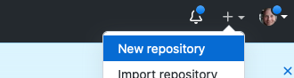
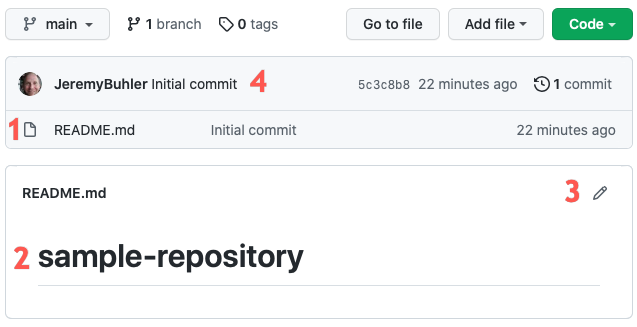
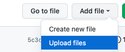
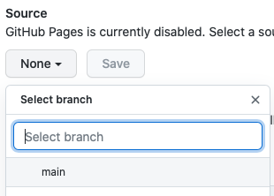

You have a Markdown file with information to share and need an inexpensive and reliable place to publish it. [GitHub](https://github.com/) is a free and widely trusted online platform that can be used to store files and folders, to edit and track changes to the files, and to publish simple websites from Markdown content.

## Git and version control
GitHub is designed for sharing _Git repositories_, collections of files that are tracked using version control software called Git. You don't need to install or learn Git to publish files on GitHub, but it's helpful to know that the structure, terminology, and workflows in GitHub are derived from Git.

Git is open source software that tracks changes made to a group of files. Each group of tracked files is stored in a  _repository_. Git takes periodic snapshots of the tracked files (these snapshots are called _commits_) and saves them in the repository to keep a record of changes, when they were made, and by whom.

### Why use version control
It takes some discipline to learn and make use of version control but there are many benefits:

* **Collaboration** - Version control helps teams work collaboratively on same set of documents without interfering with each other.
* **Versioning** - It provides a thorough log of changes to tracked files without creating multiple copies, making it easier to identify the most current version.
* **Rolling back** - Made a mistake?  Version control lets you review and undo changes, reverting to previous stages in the document's history. This can be useful when changes to your files introduce unforeseen problems.
* **Backup** - While not intended primarily as a backup solution, version control systems make it easy to keep syncronized copies of your files in multiple locations.

## GitHub for publishing
GitHub is a website for hosting and sharing Git repositories. It is designed to _complement_ a local installation of Git software, but it can also be used on its own in a web browser. In this introductory workshop we will use GitHub in a browser only, but for larger projects you may wish to lean more about Git as well. Integrating GitHub with Git allows you to edit files on your own computer with your preferred text editing tools, then periodically synchronize them with a copy of the repository in GitHub. UBC Library's [Introduction to Git and GitHub](https://ubc-library-rc.github.io/intro-git/) workshop is one way to learn more about these tools (see upcoming [workshop dates](https://researchcommons.library.ubc.ca/workshops/)).

GitHub repositories can also be published as websites. In the steps below we will create a simple repository, add a Markdown file, then publish a web version of the file using _GitHub Pages_.

### Create a repository
The first step is to create a GitHub repository for the files we want to publish. Repositories can be Public (visible to anyone) or Private (visible only to you and to GitHub users you allow access). When using free GitHub accounts only public repositories can be published as websites.  

1. Sign in to [GitHub](https://github.com)
2. In the top right corner, click the _+_ icon and select _New Repository_
    
    
    
3. On the _Create a new repository_ page
	- give your repository a name and optional description
	- leave it as _Public_ (required if publishing as webpage)
	- select _Add a README file_
	- click _Create repository_

Though not mandatory, choosing a license is an important part of openly sharing your creative work online. For help selecting an appropriate license see <https://choosealicense.com/>.

After you click _Create repository_ you'll see your new repository page:

The numbers correspond to a few key elements of the GitHub repository page:

1. A list of files and folders in your repository. In this case there is only one file, the README.md Markdown file that GitHub added when we created the repository.
2. A representation of the contents of the README file. Editing the README file will make it easy for people to understand what your repository contains when they visit it in GitHub.
3. A button to edit the file that's currently displayed. 
4. A header with information about the most recent changes to your repository. Changes made to your files in GitHub are referred to as _commits_ (the term comes from Git). Each time you save a file in GitHub, it takes a snapshot of the changes and _commits_ that snapshot to the repository as record of the changes.

### Upload file to the repository

Upload the Markdown file you created earlier to your new repository.

1. Click the _Add file_ button and select _Upload files_
    
    
    
2. Drag or select your Markdown file. 
3. Add a note to describe your _commit_ (i.e. your change to the repository) and click _Commit changes_.

Throughout the GitHub interface you will see references to _branches_. A newly created repository has only one branch called _main_. A single branch is sufficient for many projects, but if you're collaborating with others on the same repository branches can help organize your group's work.

### Publish the file with GitHub Pages

GitHub Pages is a feature that generates a static website from the files in your repository. Each Markdown file will become a page in the website.

1. On your repository page, click _Settings_ (far right in the horizontal menu)
2. On the settings page, choose _Pages_ from the menu on the left side of the screen.
3. In the _Source_ section of the GitHub Pages settings, click the _None_ button to change the source to _main_ (the main branch of your repository)
    
    
    
4. Click _Save_ 

A message will give you the URL for your new repository. It will take a few minutes for the site to be ready. Copy or bookmark this URL so you can use it later.

Sites built with GitHub pages are simple by default but can be customized with themes and enhanced with navigation and other elements. Most enhancements involve adding configuration files to the repository. If you'd like to explore these features it is helpful to know that GitHub Pages uses _Jekyll_ software to generate its websites. For more information see [Adding a theme to your GitHup Pages site using Jekyll](https://docs.github.com/en/pages/setting-up-a-github-pages-site-with-jekyll/adding-a-theme-to-your-github-pages-site-using-jekyll).

### Find your published Markdown file
By default the homepage for your newly published site will be the README file. To access view the web version of your Markdown file you have two options:

1. Rename your Markdown file to _index.md_. If an _index.md_ file is present GitHub Pages will always use it as the landing page.
2. Add your filename to the end of the URL string, replacing _md_ with _html_. For example, if your file is called _myfile.md_ your new URL would end in _myfile.html_.

## Create a QR code

Visit <https://www.qrcode-monkey.com> to create a QR code with the URL of your published Markdown file, then copy the QR code into your poster.
